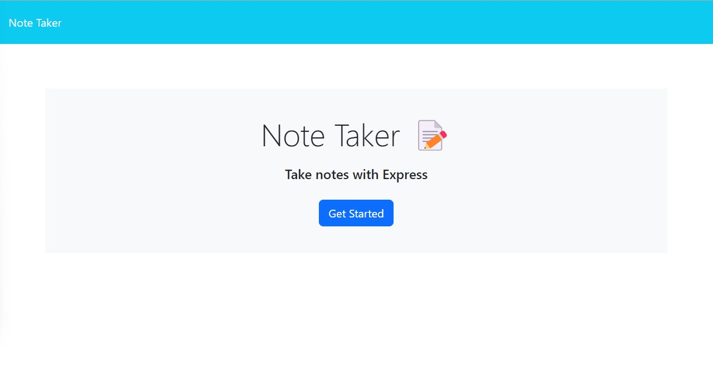
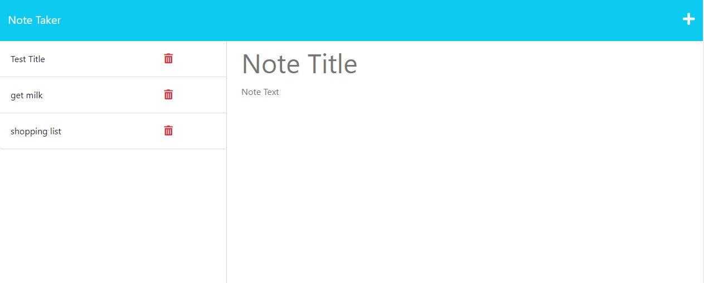

# Note Taker

## Description

Note Taker is a web application that allows users to create, save, and delete notes. The application uses an Express.js back-end and saves and retrieves note data from a JSON file.

[License](#License)

## Installation

To install the application, clone the repository and run npm install to install the required dependencies.

## Usage

To create a new note, click the pencil icon in the top-right corner of the page. Enter a title and text for your note and click the save icon.

To view a saved note, click on the note in the left-hand column. To delete a note, click the trash can icon next to the note in the left-hand column. 

## Credits

The application was created by Shaun M. It uses Express.js for the back-end and Bootstrap for the front-end.

## License

MIT License

Copyright (c) 2022 BaldOracle

Permission is hereby granted, free of charge, to any person obtaining a copy
of this software and associated documentation files (the "Software"), to deal
in the Software without restriction, including without limitation the rights
to use, copy, modify, merge, publish, distribute, sublicense, and/or sell
copies of the Software, and to permit persons to whom the Software is
furnished to do so, subject to the following conditions:

The above copyright notice and this permission notice shall be included in all
copies or substantial portions of the Software.

THE SOFTWARE IS PROVIDED "AS IS", WITHOUT WARRANTY OF ANY KIND, EXPRESS OR
IMPLIED, INCLUDING BUT NOT LIMITED TO THE WARRANTIES OF MERCHANTABILITY,
FITNESS FOR A PARTICULAR PURPOSE AND NONINFRINGEMENT. IN NO EVENT SHALL THE
AUTHORS OR COPYRIGHT HOLDERS BE LIABLE FOR ANY CLAIM, DAMAGES OR OTHER
LIABILITY, WHETHER IN AN ACTION OF CONTRACT, TORT OR OTHERWISE, ARISING FROM,
OUT OF OR IN CONNECTION WITH THE SOFTWARE OR THE USE OR OTHER DEALINGS IN THE
SOFTWARE.

To learn more, visit [website](https://peaceful-badlands-78489.herokuapp.com/notes).

